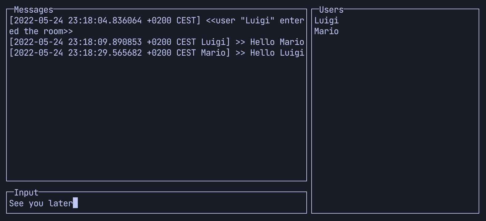

# GoChat

Basic chat room application using WebSockets and gRPC. Requires Go 1.18.



## Installation

```
go install -a github.com/marcelbeumer/crispy-octo-goggles/gochat@latest
```

## Running from source

```
go run .
```

## Usage

To run a server:

```
gochat server -V # websockets
gochat server -V --grpc # gRPC
```

To connect a client:

```
gochat client -u Mario # websockets
gochat client -u Mario --grpc # gRPC
```

For more options and details see:

```
gochat --help
```

## TODO

- Write more tests.
- Production setup: Dockerfile, (client) install/usage instructions.
